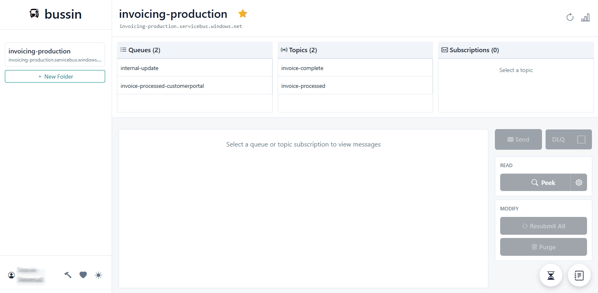
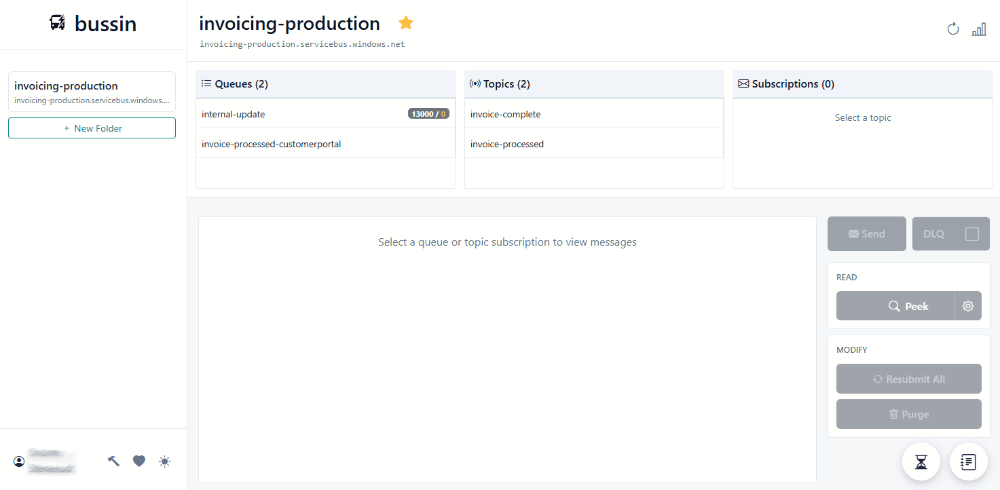
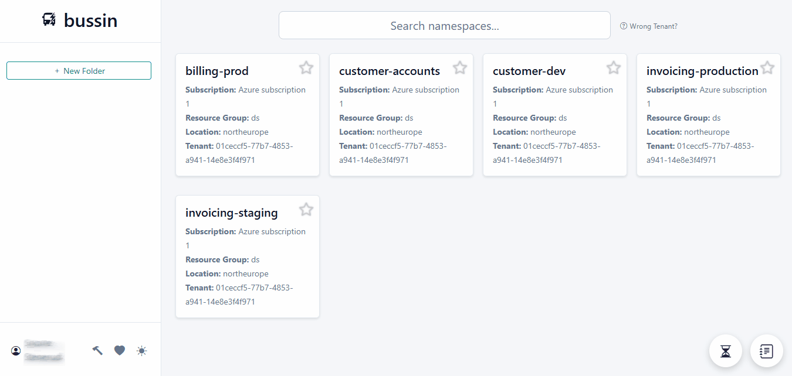
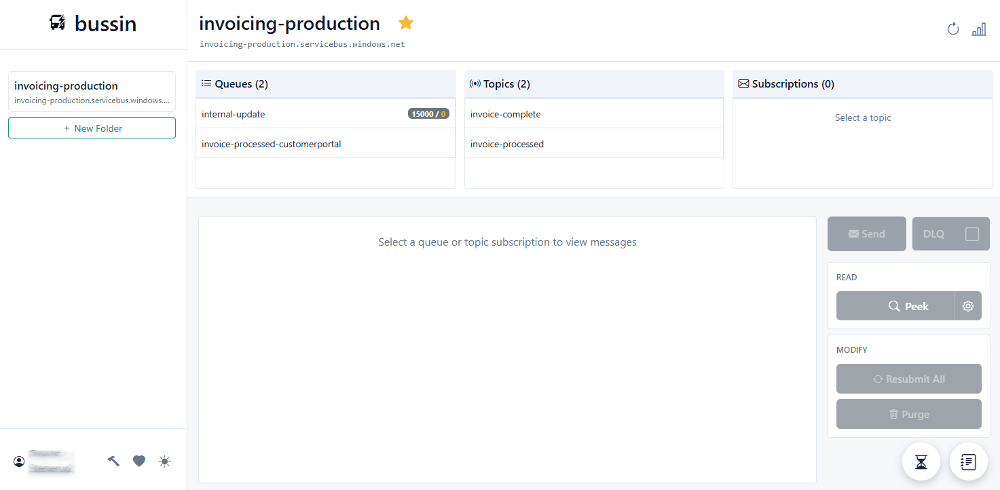
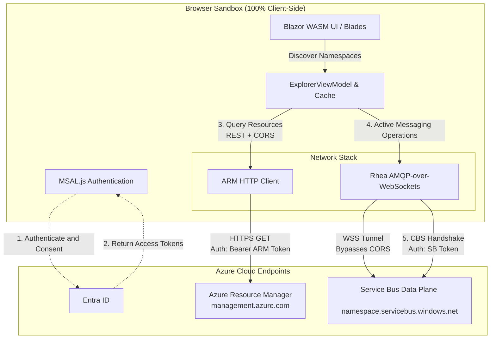

# Bussin: Azure Service Bus Explorer

Bussin is a client-side Azure Service Bus explorer. It runs entirely in your browser as a Progressive Web App (PWA). You can access the live version at **[https://bussin.dev](https://bussin.dev)**.

Because all connections are established directly from your browser to Azure, there is no backend proxy or intermediate server transiting your credentials or messaging payloads.

[](https://bussin.dev/)

---

## Features

### Background Operations
Run connection-safe bulk actions in the background without freezing the user interface.


### Batch Transmissions
Send high-volume message payloads using concurrent AMQP pipelining.


### Bulk Management
Resubmit or delete combinations of active and dead-letter messages with dynamic depth-locking to prevent data loss.


### Namespace Organization
Manage multiple Entra ID environments using folder nesting and text searching.


### Message Search
Search and peek messages using property and body pattern matching.


---

* **Direct Client-Side Architecture**: Your data never leaves your browser. Bussin communicates directly with Azure APIs.
* **Zero Installation**: Access the tool online at [https://bussin.dev](https://bussin.dev/) or install it as a PWA.
* **Entra ID Integration**: Authenticate securely using your existing Azure identity and Role-Based Access Control (RBAC) roles.

## Architecture and Security

Bussin operates under a 100% proxy-free, client-side security model. 

When you open Bussin, your browser acts as the direct orchestrator of all network and authentication flows, bypassing intermediate relay servers or third-party databases. 



### Protocol and Connection Mechanics

1. **Azure Resource Manager (ARM) Discovery**: Bussin queries the Azure management API over HTTPS using standard CORS (Cross-Origin Resource Sharing) requests. This enables automatic resource discovery of subscriptions, resource groups, namespaces, queues, and topics without typing connection strings.
2. **Azure Service Bus Data Plane (CORS Bypass)**: Standard Azure Service Bus data-plane REST endpoints lack CORS headers, which prevents standard browser HTTPS REST calls. Bussin bypasses this restriction by establishing direct AMQP 1.0 connections over secure WebSockets (`wss://<namespace>.servicebus.windows.net:443/$servicebus/websocket`), which do not fall under CORS restrictions.
3. **Identity and Claims-Based Security**: All communication is secured using your active Entra ID tokens. The client performs an AMQP Claims-Based Security (CBS) handshake with the `$cbs` node of the namespace directly, matching standard enterprise security policies without storing credentials.

## Alternatives

Bussin serves as a cross-platform, web-native alternative to traditional desktop messaging clients:

* **No Backend**: Unlike other web-based explorers, Bussin has no backend. Your Service Bus connection strings or tokens are never sent to external servers.
* **Clean UI**: A responsive interface built with Blazor WebAssembly.
* **Dev-Focused**: Simple debugging for queues, topics, and subscriptions.

## Permissions and Security

Bussin respects your Azure RBAC configuration. It uses two-step delegated consent:
1. **Azure Management API**: To list namespaces and entities.
2. **Azure Service Bus**: For data-plane operations (Peek, Send, etc.).

*Required Roles:* Azure Service Bus Data Owner, Receiver, or Sender.

## Development

Requirements:
* .NET 10 SDK
* Node.js 20+

```bash
# Build client-side AMQP library
cd client-js && npm ci && npm run build

# Build Blazor WASM app
cd ../src && dotnet publish -c Release
```

## Releases

When creating a new release of Bussin on GitHub, please ensure the release notes include a link pointing back to the official site:
`For more details and live usage, visit https://bussin.dev.`

## License

Business Source License 1.1 (BSL) - See [LICENSE](LICENSE) file for details.
* Usage of the software is always free for personal, educational, or internal business use.
* Commercial redistribution, rebranding, or hosting this software as a service (SaaS) by third parties is prohibited.

---

*Disclaimer: Bussin is a community tool and is not officially supported by Microsoft. Use at your own risk.*
